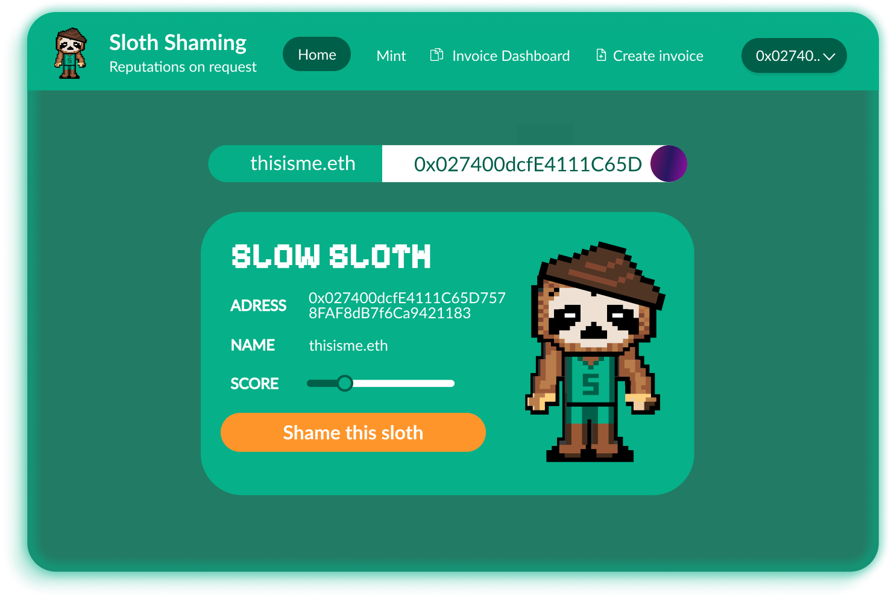

<h1 align="center">
🦥🦥🦥 Sloth Shaming 🦥🦥🦥
</h1>

<h4 align="center">
  <a href="https://slothshaming.com">Website</a> |
  <a href="https://github.com/arjanjohan/scaffold-request-extension">Scaffold-Request-Extension </a>
  

    
  

</h4>

🦥 Sloth Shaming is a platform that allows you to create a profile, receive ratings based on your invoices on Request Network, and wether or not you are paying them on time. Late payers will be named and shamed, and responsible payers will be rewarded with good reputation, and as an effect, have provable credibility.

- ✅ **Register account**: Register an account using metamask.
- 🩻 **SoulBound**: Upon registration users will receive a soulbound token that represents their profile.
- ⛓️ **Dynamic NFT**: The associated NFT will be dynamically changed throughout your activity history on request network.
- 🔎 **Search the Registry**: Search for anyone, using ther ethereum address or ENS name to quickly check their reputation.
- 💅 **Name and Shame**: If a payer has a late payment, we have added a function to post an auto LLM generated roast on x dot com the everything app.
- 🎨 **Handmade art**: Like the art you see? All art and assets for the sloth shaming project is hand drawn by [Maarten](https://x.com/Mdjvanh)

## Ratings

Each time the uri is called, a calculation is being made in order to mark the holder as one of the following titles.

The formula for calculating the rating made like this: We loop through all the invoices sent to the SBT holder. From this we will generate a series of numbers to the holder. Each payment made on time will push the number 100 to the list, and each payment that is too late the number 0 gets pushed to the list. From there an avarage number of the numbers in the list is calculated resulting in the following titles:

|     Slow Sloth 0-70 points     |  Neutral Wolf 70-90 points  |    Speedy Cheetah 90-100 points    |
|--------------------------------|-----------------------------|------------------------------------|
|  | |  |

If you find a sloth, there is the possibility to post a roast for this slow payee on x dot com the everything app in a single click

## Diagrams
### Create NFT

### Display NFT

## Bounties 😎

### Request Network - Best app that creates requests
We created a reputation system for to create, query and update reputation on chain. 

### BuidlGuidl - Best Scaffold-ETH2 Submission
We initialized the project using Scaffold-ETH 2 with the [SE2 Request Network extension](https://github.com/arjanjohan/scaffold-request-extension). 

### Worldcoin - Best Use of World ID 
We use Worldcoin World ID for preventing sybil and spam attacks, to ensure a more fair and robust reputation system.

### Golem
Our initial idea was to automatically generate roasts for late payments, we use Golem to run an AI model. These roasts would then get posted to x dot com the everything app. However we ran into some issues with golem not being compatible with next.js, which we were using for this project. However, we tried [really hard to make it work...](https://github.com/warsaw-hackers/Sloth-Shaming/commit/e3f74e0ccc45d9b1b83b66476b7631af8f66498b)

### Optimism
We deployed our contracts on Optimism Sepolia, because Worldcoin World ID is required for our dApp. Also it's possible to pay invoices on Optimism within our dApp. [Deployment](https://sepolia-optimism.etherscan.io/address/0xBf8C8Ef202C8D14f8657f6E476c0F115906c773D)

### Celo
Celo is available as a payment Chain on our Request Network dApp. Also, we use Celo Alfojores testnet for for creating a SBT in our registry. [Deployment](https://explorer.celo.org/alfajores/address/0x81afFbf9392a1402B44B8b6C45C89F602657b3eF)

### DragonSwap - Pooled bounty
We use Sei network for for creating a SBT in our registry. [Deployment](https://seitrace.com/address/0xF519289Ed67326514c6Eb47851f9e605DC8ad640?chain=pacific-1)

### Zircuit - Best Project on Zircuit
We use Zircuit testnet for for creating a SBT in our registry. [Deployment](https://explorer.testnet.zircuit.com/address/0x81afFbf9392a1402B44B8b6C45C89F602657b3eF)

### Mantle Network - Best UX/UI project
Mantle is available as a payment Chain on our Request Network dApp. Also, we use Mantle testnet for for creating a SBT in our registry. [Deployment](https://explorer.sepolia.mantle.xyz/address/0xF519289Ed67326514c6Eb47851f9e605DC8ad640?tab=txs)

### ENS - Best use of ENS
Our dapp fully supports ENS names, and users are able to search and interact with others using their ENS name as well as their wallet address.

## Next steps

- We want to bring this tool primarly in the hands of hackathons in order for hackers to be able get a picture of the credibility of a company and wether or not they are likely to pay the bounties to the winning hackers.

## Links

- https://explorer.celo.org/alfajores/address/0x81afFbf9392a1402B44B8b6C45C89F602657b3eF
- https://seitrace.com/address/0xF519289Ed67326514c6Eb47851f9e605DC8ad640?chain=pacific-1
- https://explorer.testnet.zircuit.com/address/0x81afFbf9392a1402B44B8b6C45C89F602657b3eF
- https://explorer.sepolia.mantle.xyz/address/0xF519289Ed67326514c6Eb47851f9e605DC8ad640?tab=txs
- https://sepolia-optimism.etherscan.io/address/0xBf8C8Ef202C8D14f8657f6E476c0F115906c773D
- https://github.com/arjanjohan/scaffold-request-extension

## Team

- [arjanjohan](https://x.com/arjanjohan)
- [0xjsi.eth](https://x.com/0xjsieth)
- [nhestrompia.eth](https://x.com/nhestrompia)
- [Maarten](https://x.com/Mdjvanh)